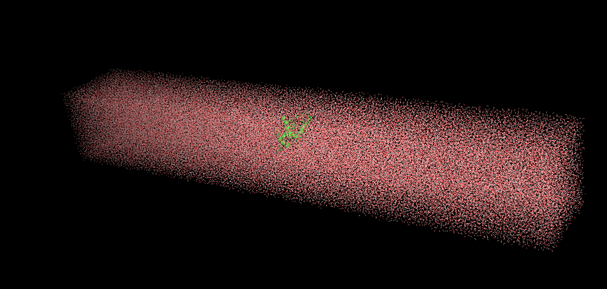
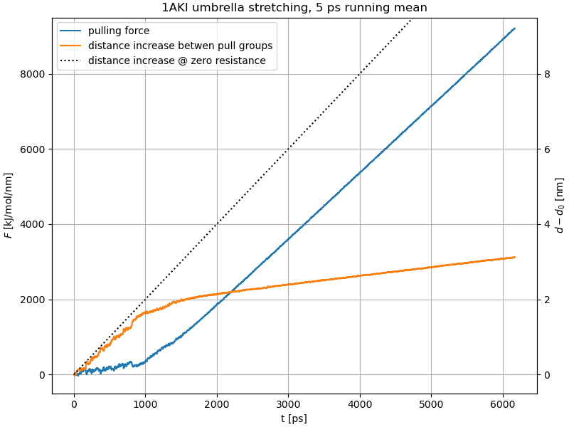
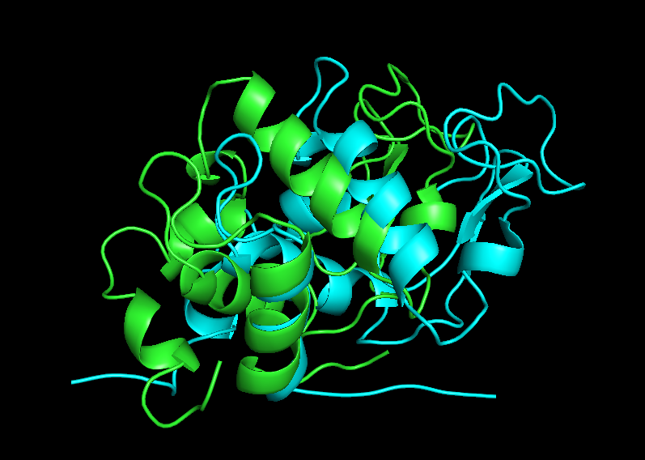

### Hen egg-white lysozyme in water

The treatment of this system is divided into two parts. The first part follows [this introductory tutorial](http://www.mdtutorials.com/gmx/lysozyme/index.html) by J.A. Lemkul on simulating a protein in solution over a short timespan; the second part deals with observing conformational changes in the protein upon applying a stretching force to it.

We are simulating a single lysozyme (an enzyme with an antimicrobial function in the immune system, PDB code 1AKI). The tertiary structure is shown on the left, visualization courtesy of PyMOL. The plot on the right-hand side shows fluctuations in the density of the system during equilibration. The fact that the effective density is 1020 kg/m³, only slightly higher than that of water, even though mean protein density is usually  1350 kg/m³, shows that only a tiny fraction of the unit cell is occupied by the protein - all the rest consisting of solvent (water).

 

The production simulation was only left to run for 500 ps, as the purpose of the task was to become familiar with the basic tools and capabilities offered by GROMACS. The plots below show that no drastic changes in the conformation were observed in that time, although the radius of gyration increased slightly.

 

-----

For the second part, the steps from the tutorial up to and including the equilibration were redone in a larger, much more elongated unit cell 7.5 x 7.5 x 50 nm in size. This one had to be populated with 90 000 water molecules! You can barely make out the protein:

I have chosen residues 1 and 129 at the ends of the backbone as pull groups. Since they were oriented almost exactly along the long axis of the solvation box, no reorientation was performed, but the distance pulling geometry may still impose some torque on the lysozyme.

Running the entire pulling code until the chain is entirely stretched out is going to take a while. In the meantime, the results of the first nanosecond seemed promising - while it may be too early for quantitative evaluation, qualitatively it made sense. The distance between the pull groups was increasing slightly slower than if the chain offered zero resistance, which is visible in the simultaneous increase of force, and sudden increases in distance corresponded to drops in the pulling force. After this initial regime, something strange happens - the protein seems to stiffen up and stop unfolding, while the pulling force grows to several thousands of kJ/mol/nm.

It is possible that the MD run was started with a misparametrized set of values. If the bonds do not rupture within a couple of nanoseconds more, I am going to admit failure on this project.
