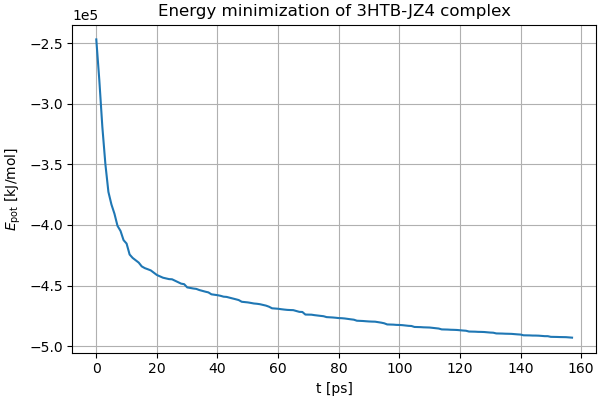
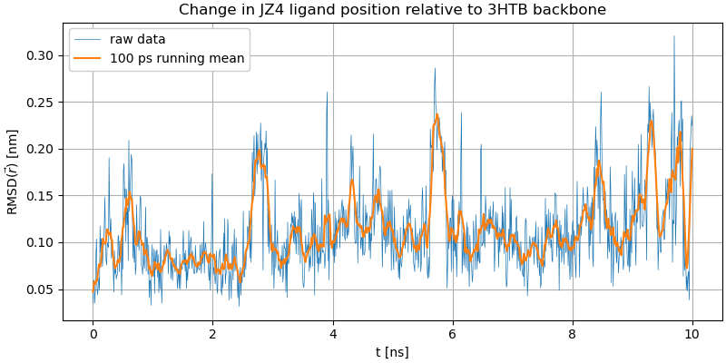
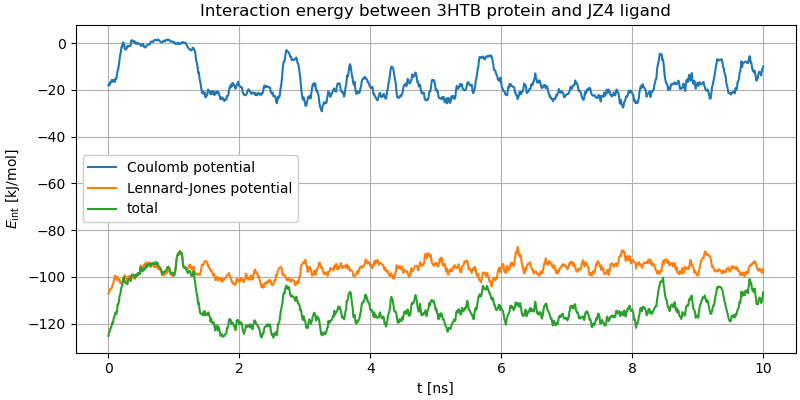
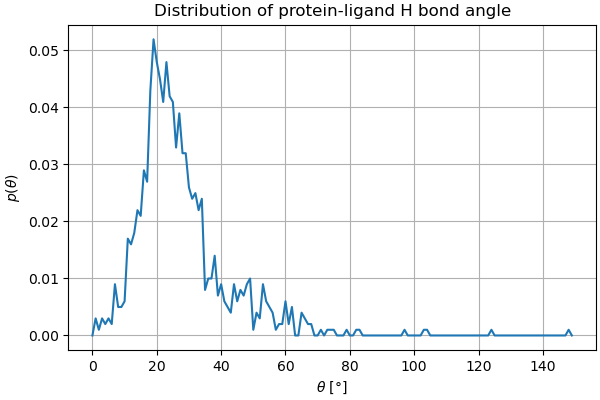

### Protein-ligand complex

The results here were obtained by following [this tutorial](http://www.mdtutorials.com/gmx/complex/index.html) by J.A. Lemkul.

The simulated system is a T4 Lysozyme in complex with a 2-propylphenol molecule (JZ4). The tertiary structure is shown on the left, with the ligand clearly visible and the protein partially transparent; after preparing everything and adding some 10 000 water molecules, we are left with a significantly more crowded screen (right). Both visualizations courtesy of PyMOL.

 

The energy minimization brought no surprises.

After the addition of chlorine ions and equilibration, a production run of 10 nanoseconds was made. On my machine, this entire run took around 100 hours of core time, which may sound like a lot, but keep in mind it's a dinky little laptop with a i5-8265U, and it was likely throttled to within an inch of its life.

Let's look at some results. First up is the change in relative position of the ligand and protein backbone. Since the system should have been already equilibrated at the beginning of the production simulation, we're expecting the fluctuation to be small. Indeed, the tutorial expects a RMSD of around 0.1 nm.

This is true *most* of the time, but there are several odd jumps where the molecule suddenly spends some hundreds of picoseconds in an unexpected position. This is not a transient behaviour either; the positions seems to grow less stable towards the end of the simulation. Maybe the interaction energies can provide a clue?

While some fluctuations are visible in the the Lennard-Jones interaction term, the jumps seem to originate from sudden, temporary reductions in the Coulomb interaction. At first I thought this might be attributable to an ion passing close by, but this turned out not to be the case. It is as if the hydrogen bond kept breaking and re-forming. I hope to revisit this in the future armed with more knowledge about similar systems.

Speaking of the hydrogen bond, here is a not-quite-histogram of the bond angles, consistent with the presence of a bond, although the rather heavy tail could indicate temporary breaking.

