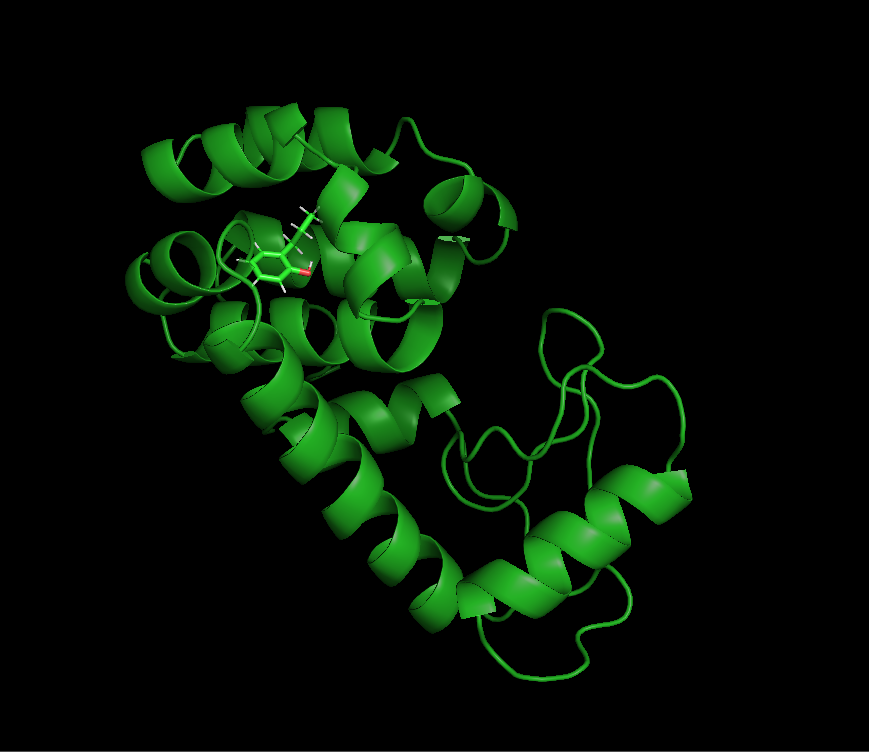
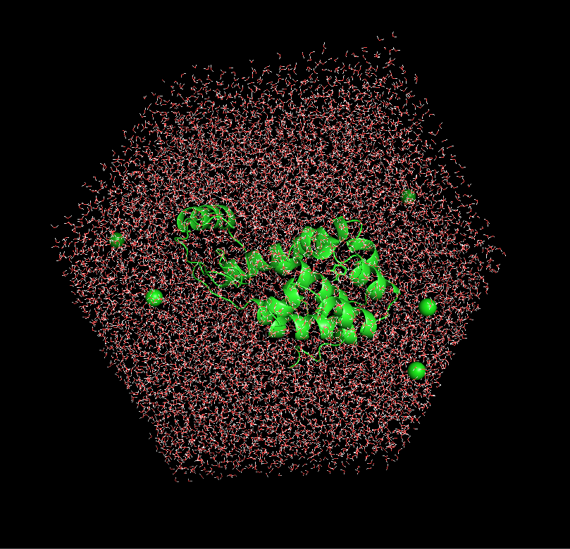

### Protein-ligand complex

The results here were obtained by following [this tutorial](http://www.mdtutorials.com/gmx/complex/index.html) by J.A. Lemkul.

The simulated system is a T4 Lysozyme in complex with a 2-propylphenol molecule (JZ4). The tertiary structure looks like this:

After preparing everything and adding some 10 000 water molecules, we are left with a considerable busier system:

